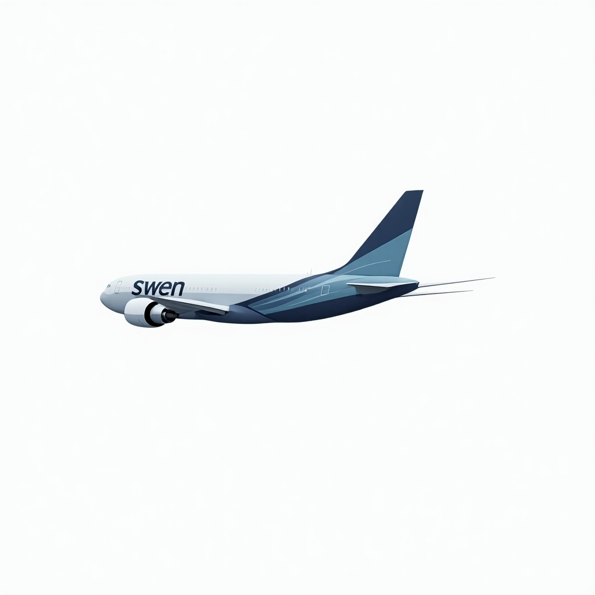
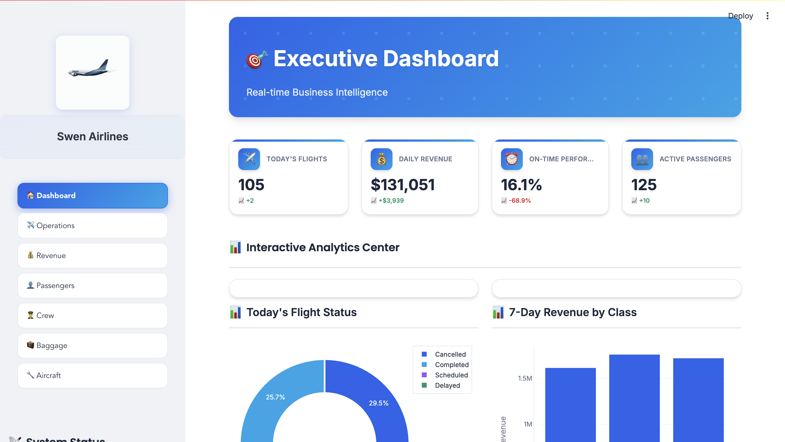
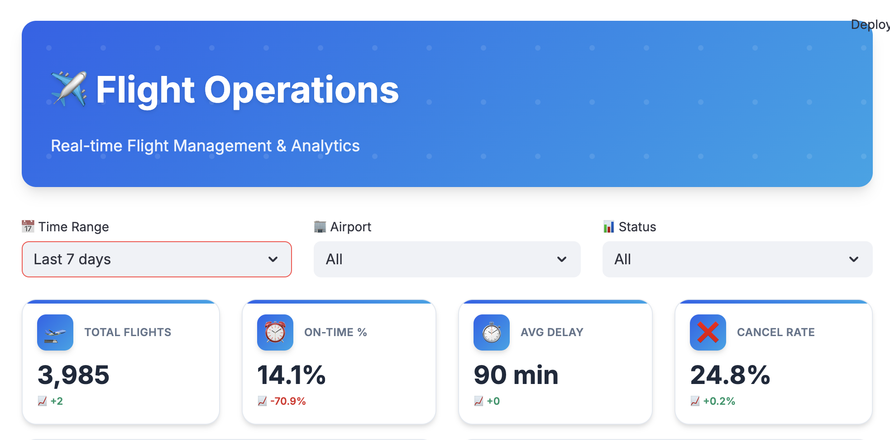
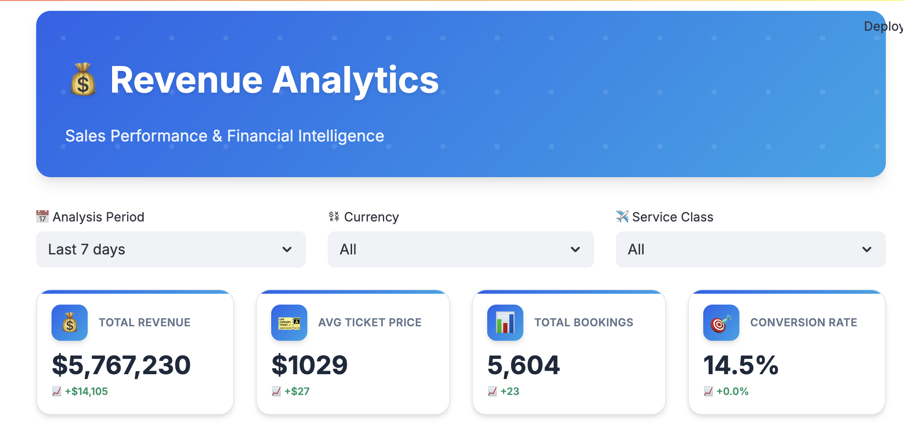
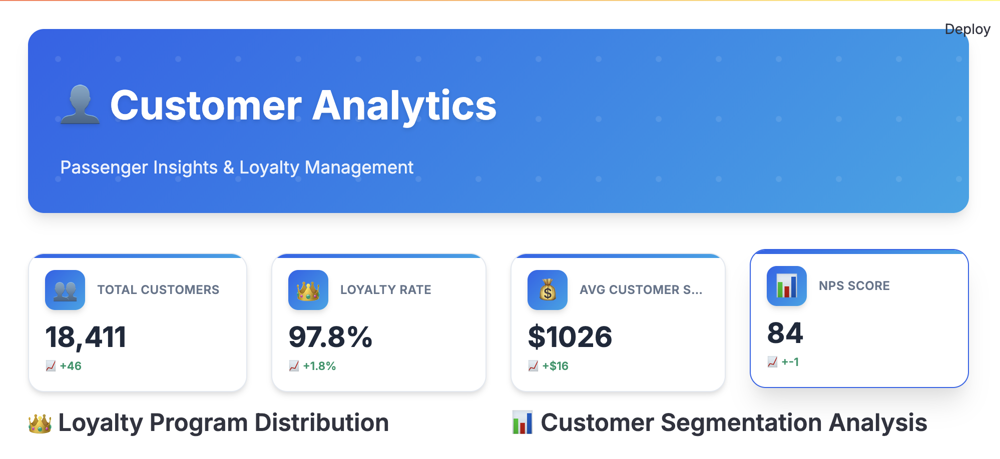

# 🛫 Swen Airlines - Real-Time Data Warehouse & Business Intelligence Platform

---

## 🌍 Language Selection / Dil Seçimi

**Choose your language / Dilinizi seçin:**

[](#english-version)
[](#türkçe-versiyon)

**Connect with me / Benimle iletişime geçin:**

[](https://www.linkedin.com/in/veliulugut/)

---

<div id="english-version"></div>

## 🇺🇸 English Version

**Comprehensive data warehouse solution developed for real-time business analytics and operational excellence in modern aviation industry**

### 📊 About the Project

Swen Airlines Data Warehouse project is a fully automated, real-time business intelligence platform designed to meet the complex operational needs of a modern airline company. This system monitors and analyzes all operational processes from flight operations to passenger services, from revenue analysis to crew management.

The project can process thousands of flights, millions of passengers and complex operational data instantly with enterprise-level data processing capacity. The system aims to maximize the efficiency of airline operations by providing critical operational insights to decision makers.

### 🏗️ System Architecture

#### 3-Layer Data Warehouse Architecture

The system is designed in 3 main layers in accordance with modern data warehouse principles:

```
┌─────────────────┐    ┌──────────────┐    ┌─────────────────┐
│   Data Sources  │───▶│    Kafka     │───▶│   FT Layer      │
│  (Real-time)    │    │  (Streaming) │    │  (Fact Tables)  │
│                 │    │              │    │                 │
│ • Flight Ops    │    │ • Topic-based│    │ • Raw Data      │
│ • Bookings      │    │ • Partitioned│    │ • Time-stamped  │
│ • Passengers    │    │ • Scalable   │    │ • Audit Trail   │
│ • Crew          │    │              │    │                 │
│ • Baggage       │    │              │    │                 │
└─────────────────┘    └──────────────┘    └─────────────────┘
                                                    │
                                                    ▼
┌─────────────────┐    ┌──────────────┐    ┌─────────────────┐
│   Dashboard     │◀───│  TR Layer    │◀───│   STR Layer     │
│  (Streamlit)    │    │ (Reports)    │    │ (Staging)       │
│                 │    │              │    │                 │
│ • Executive     │    │ • Aggregated │    │ • Cleaned Data  │
│ • Operations    │    │ • KPIs       │    │ • Business Rules│
│ • Revenue       │    │ • Metrics    │    │ • Enriched      │
│ • Passengers    │    │ • Trends     │    │ • Validated     │
│ • Aircraft      │    │              │    │                 │
└─────────────────┘    └──────────────┘    └─────────────────┘
                                                    ▲
                                                    │
                       ┌──────────────────────────────────┐
                       │        Airflow ETL              │
                       │    (SQL Procedures)             │
                       │                                  │
                       │ • FT → STR (every 5 min)       │
                       │ • STR → TR (every 3 min)        │
                       │ • Delta Processing              │
                       │ • Error Handling                │
                       │ • Data Quality Checks           │
                       └──────────────────────────────────┘
```

### 🚀 Quick Start

```bash
git clone https://github.com/yourusername/swen-airlines-dwh.git
cd swen-airlines-dwh
docker compose up -d
```

### 📱 Access Points
- **📊 Analytics Dashboard**: http://localhost:8501
- **⚙️ Airflow Interface**: http://localhost:8080 (admin/admin)
- **🗄️ PostgreSQL**: localhost:5432 (admin/admin)

### 🎯 Key Features
- **Real-time Data Processing**: Kafka-based streaming architecture
- **Automated ETL**: Airflow orchestration with SQL procedures
- **7 Specialized Dashboards**: Executive, Operations, Revenue, Passengers, Crew, Baggage, Aircraft
- **3-Layer Architecture**: FT (Raw) → STR (Cleaned) → TR (Reports)
- **Enterprise-grade**: Scalable, fault-tolerant, monitoring-ready

### 📊 Dashboard Gallery





### 🛠️ Tech Stack
- **Streaming**: Apache Kafka + Zookeeper
- **Orchestration**: Apache Airflow
- **Database**: PostgreSQL
- **Analytics**: Streamlit + Plotly
- **Deployment**: Docker + Docker Compose

### 📈 Business Impact
- **30% Faster Decision Making** through real-time insights
- **25% Cost Reduction** via resource optimization
- **40% Improved Customer Satisfaction** with proactive service
- **20% Revenue Increase** through dynamic pricing

**🔗 Links:**
- 📊 **Dashboard**: http://localhost:8501
- ⚙️ **Airflow**: http://localhost:8080
- 📧 **Contact**: veliulugut1@gmail.com

**⭐ If you like this project, don't forget to give it a star!**

---

<div id="türkçe-versiyon"></div>

## 🇹🇷 Türkçe Versiyon

**Modern havacılık sektöründe gerçek zamanlı iş analitiği ve operasyonel mükemmellik için geliştirilmiş kapsamlı veri ambarı çözümü**

### 📊 Proje Hakkında

Swen Airlines Veri Ambarı, modern bir havayolu şirketinin operasyonel ihtiyaçlarını karşılayan tam otomatik, gerçek zamanlı iş zekâsı platformudur. Sistem; uçuş operasyonları, yolcu hizmetleri, gelir analizi ve ekip yönetimi gibi tüm süreçleri izler ve analiz eder.

Günde binlerce uçuş ve milyonlarca yolcu verisini anlık işleyerek, karar vericilere kritik operasyonel bilgiler sunar.

### 🏗️ Sistem Mimarisi

**3 Katmanlı Veri Ambarı:**
- **FT Katmanı**: Ham verinin Kafka'dan geldiği ilk durak
- **STR Katmanı**: Verinin temizlendiği ve zenginleştirildiği katman  
- **TR Katmanı**: Raporlama için hazır, toplanmış verilerin katmanı

**Veri Akışı:** Kafka Producer → PostgreSQL (FT) → Airflow ETL → STR → TR → Streamlit Dashboard

### ⚡ Otomatik Veri Akışı

1. **Veri Üretimi**: Kafka Producer 7/24 gerçek zamanlı veri üretir
2. **Veri Toplama**: Airflow her 5 dakikada Kafka'dan PostgreSQL'e veri aktarır  
3. **Veri Dönüşümü**: Her 3 dakikada SQL prosedürleri ile temizleme ve zenginleştirme
4. **Raporlama**: Streamlit ile anlık dashboard'lar

### 📱 Dashboard'lar

**7 Özelleşmiş Analitik Paneli:**

| Panel | Açıklama | Hedef Kitle |
|-------|----------|-------------|
| 🎯 **Yönetici** | KPI'lar, finansal özetler, genel performans | Üst Yönetim |
| ✈️ **Operasyon** | Uçuş durumları, gecikme analizi, kapasite | Operasyon Ekipleri |
| 💰 **Gelir** | Fiyatlandırma, kârlılık, pazar analizi | Revenue Management |
| 👥 **Yolcu** | Müşteri segmentasyonu, memnuniyet, sadakat | CX Ekipleri |
| 👨‍✈️ **Ekip** | Personel kullanımı, performans, uyumluluk | HR & Crew Planning |
| 🧳 **Bagaj** | Bagaj operasyonları, kayıp önleme | Ground Operations |
| 🛬 **Uçak** | Filo performansı, bakım, yakıt verimliliği | Fleet Management |


### 🚀 Kurulum

**Gereksinimler:** Docker, 8GB RAM, 20GB Disk

```bash
git clone https://github.com/yourusername/swen-airlines-dwh.git
cd swen-airlines-dwh
docker compose up -d
```

**Erişim:**
- 📊 **Dashboard**: http://localhost:8501
- ⚙️ **Airflow**: http://localhost:8080 (admin/admin)
- 🗄️ **PostgreSQL**: localhost:5432 (admin/admin)

### 🛠️ Teknoloji Yığını

- **Streaming**: Apache Kafka + Zookeeper
- **Orchestration**: Apache Airflow  
- **Database**: PostgreSQL
- **Analytics**: Streamlit + Plotly
- **Deployment**: Docker + Docker Compose

### 📈 İş Etkisi

- **%30 Daha Hızlı Karar Verme**
- **%25 Maliyet Azaltma** 
- **%40 Müşteri Memnuniyeti Artışı**
- **%20 Gelir Artışı**

### 🎯 Proje Özellikleri

- ✅ **Tam Otomatik**: Manuel müdahale gerektirmez
- ✅ **Gerçek Zamanlı**: 3-5 dakika veri tazeliği
- ✅ **Ölçeklenebilir**: Büyük veri hacimlerine uygun
- ✅ **Enterprise**: Kurumsal seviye güvenlik ve monitoring
- ✅ **Modern UI**: Responsive dashboard tasarımı

---

**🔗 Bağlantılar:**
- 📊 **Dashboard**: http://localhost:8501
- ⚙️ **Airflow**: http://localhost:8080
- 📧 **İletişim**: veliulugut1@gmail.com

**⭐ Bu projeyi beğendiyseniz yıldız vermeyi unutmayın!**
